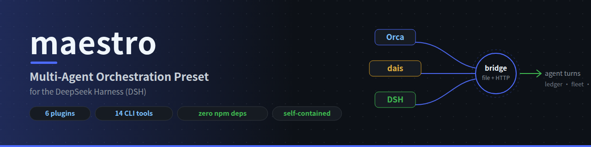
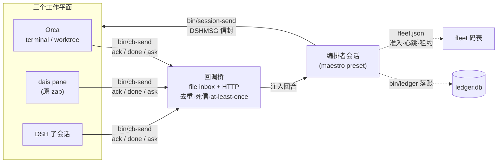

# maestro — 高级编排模式(DSH agent preset)

**Turn a DeepSeek Harness session into a multi-agent orchestration supervisor** — coordinating work across **Orca** terminals/worktrees, **dais** panes (formerly zap), and **DSH** subagent sessions over a durable callback bridge, with a SQLite project ledger and a compiled supervision plane.

[](./LICENSE)
[](#包结构)
[](docs/PACKAGING.md)


> **English TL;DR** — maestro is a self-contained [DeepSeek Harness](https://github.com/deepseek-ai) *agent preset*: clone it into `~/.dsh/.agent-presets/maestro`, pick the preset in a new session, and that session becomes an orchestration supervisor. It ships 6 plugins (file-pump + HTTP callback bridge, host-lane bridge, workspace unarchive, session purge), 14 CLI tools (cross-session messaging, fleet admission/leases, ticket dispatch, SQLite ledger, flow compiler), and peer-discovery skills for Claude/Orca/dais agents. Zero npm dependencies — `node:*` builtins and relative imports only. Full manual: [USAGE.md](./USAGE.md).

跨 Orca、dais(原 zap,2026-08-17 改名)、DSH 三平面的多 agent 编排套件,以 DSH **agent preset** 形态分发。本目录自包含: 插件、技能、脚本全部随包走,零 npm 依赖(仅 `node:*` 内建 + 相对 import)。

> 装好后怎么用 → **[使用说明 USAGE.md](./USAGE.md)**;开发调试(dev-sync 同步,禁用软链接)→ USAGE §10;打包规范(怎么装成插件/怎么发布)→ **[PACKAGING.md](./docs/PACKAGING.md)**;回调桥抽象设计 → [callback-bridge-design.md](./docs/callback-bridge-design.md)。

## 为什么值得一个 Star

| 能力 | 一句话 |
|---|---|
| **双通道回调桥** | 文件桥(at-least-once: 去重/死信/轮转/游标)+ HTTP 直发,对端 `cb-send` 自动降级,投递语义有持久证据 |
| **host lane** | `host-callback-bridge` 把回调链路上移到宿主 boot,sessionId 成为跨重启的持久路由键 |
| **fleet 准入** | Orca 终端 `probing→verified` 探测准入 + 心跳 + 属主租约(`fleet-touch claim/heartbeat/release/sweep`) |
| **SQLite 项目账本** | 分发/回收/审查全落账,节点过程跨会话持久(`bin/ledger`) |
| **flowc 编排编译器** | `flow.yml` → 状态机(节点/单元/触发器 SQL),十动词监督面 |
| **回合外事件守护** | `event-watchd` 常驻巡检,agent 不在场也能推进 |
| **对端冷发现** | `shared/maestro-bridge` 技能镜像到 `~/.agents/skills`,Claude/Orca/dais 侧 agent 凭它接入回调协议 |
| **分发即复制** | 无构建、无 npm install、无第三方依赖;`git clone` 即用 |



## 前置要求

| 依赖 | 用途 | 缺失时的降级 |
|---|---|---|
| DeepSeek Harness (DSH) | 宿主 | 不可用 |
| Orca (`orca-ide`/`orca-dev`) | 桥 pane、terminal send、worktree 管理 | 仅剩普通编码能力,编排面不可用 |
| sqlite3 CLI | 项目状态账本 | 账本技能不可用 |
| python3 + curl | bin 脚本(session-send/cb-send/fleet-probe 等) | 对应脚本不可用 |
| dais (原 zap,可选) | dais 平面投递 | 该平面跳过 |

## 安装

```bash
# 方式一: git(推荐,可升级)
git clone https://github.com/fiultyy/maestro-preset.git ~/.dsh/.agent-presets/maestro

# 方式二: 复制目录
cp -r maestro/ ~/.dsh/.agent-presets/maestro
```

可选但推荐——安装**对端共享 skill**(其他 harness 的 agent 冷发现回调协议;开发流 `bin/dev-sync.sh` 自动完成,无需手工):

```bash
mkdir -p ~/.agents/skills
cp -r ~/.dsh/.agent-presets/maestro/shared/maestro-bridge ~/.agents/skills/
ln -sfn ~/.agents/skills/maestro-bridge ~/.claude/skills/maestro-bridge   # claude 发现面
```

安装后**新建会话**,preset 列表出现「高级编排模式」,选用即挂载。preset 一经选用不可热切换;升级 = `git pull` + 重启 DSH 进程(运行中会话保持加入时的代际,属预期)。

## 包结构

```
maestro/
├── preset.yml            # 名字/描述(官方 schema: name/description[/order],本包不设 order → 排在官方集之后)
├── agent.cordis.yml      # 组合文件: persona(编排纪律)+ 每插件一行的注册表(路径相对本目录、写到精确 .js)
├── plugins/              # 插件(每个 = 一个 ESM 入口,export inject + apply(ctx, config))
│   ├── orca-callback/    #   文件桥泵 v3.6: fs.watch 桥 inbox → at-least-once 投递(多消费者寻址/去重/死信/轮转)
│   ├── message-bridge/   #   HTTP 直发 v1.3: 127.0.0.1 随机端口 POST /callback(addr 精确路由 + 端口代际校验)
│   ├── host-callback-bridge/  # host lane: 宿主 boot 承载回调链路(受理即持久,sessionId 跨重启路由)
│   ├── callback-bridge/  #   统一内核抽象(Sources→Codec→内核→Sink,双通道共享语义;含测试)
│   ├── workspace-unarchive/  # 会话归档恢复(活体 registry 走 setState 同路径)
│   └── session-purge/    #   按需删除会话(RPC 面无 session.delete,补全生命周期)
├── skills/               # 技能(模型按需加载的操作手册)
│   ├── orca-bridge/      #   建 pane 桥、watcher、回复署名约定(含可执行脚本)
│   └── maestro-ledger/   #   账本读写手册(含脚本)
├── bin/                  # CLI 脚本(14 个;dev-sync 镜像到 ~/.dsh/maestro/bin 作兜底)
│   ├── session-send      #   跨会话消息直发(DSHMSG 信封 → /api/session.prompt)
│   ├── session-spawn     #   起新会话并入 fleet(回显 4 位码)
│   ├── session-purge     #   调 session-purge 插件的 purge 端口
│   ├── cb-send           #   对端回调投递(ACK/DONE 握手;HTTP 优先,文件桥兜底;HTTP 200≠送达,见 USAGE §3.3)
│   ├── fleet-probe       #   Orca 终端准入探测(termid 回报验证后才入编排列表)
│   ├── fleet-touch       #   fleet 心跳 + 属主租约(claim/heartbeat/release/sweep)
│   ├── flowc             #   编排编译器 v2(flow.yml → 状态机,十动词监督面)
│   ├── ledger            #   账本助手(node/event/review/status/ticket,替代手写 SQL)
│   ├── dispatch-ticket   #   票派发一体化: 读票→组契约→terminal send→落账
│   ├── event-watchd      #   回合外常驻事件守护(声明式四类看守面)
│   ├── wave-checkpoint   #   波次检查点机读 JSONL(原子追加)
│   ├── msg-dedup         #   收方回合首动作去重(信封 v2,60s 窗口)
│   ├── verify-report     #   审查助手: 重跑验证门 + 解析回报 → A/B/C 判定草稿
│   └── dev-sync.sh       #   开发同步: 正向 / --reverse 回流 / --verify 漂移报告
├── shared/               # 对端共享 skill(镜像到 ~/.agents/skills,供其他 harness 的 agent 发现)
│   ├── maestro-bridge/   #   冷执行回调手册(身份自查/cb-send/消息语义/红线/排查)
│   └── skills/dais-orchestration/  # dais 平面 v2 命令面 + 别名透明代理契约
├── tests/                # 自测(cb-send 降级链 + OF-001..010 加固波自测)
├── docs/                 # 设计文档(DESIGN / callback-bridge 抽象 / orch-loop / fleet 约定 / PACKAGING)
├── host/                 # 独立分发面①: 装点自研插件(host/install.sh 统一安装,dev-sync 不碰)
│   ├── packages/         #   4 个 @deepseek-ai/dsh-long-task* 构建包 → profile node_modules
│   ├── plugins/          #   random-uuid-polyfill / workspace-unarchive / ui-agent-pool → ~/.dsh/plugins
│   └── polyfill.patch.yml#   host 补丁组合模板(run-web.sh --patch 挂载,路径 DSH_HOME 感知)
└── agent-presets/        # 独立分发面②: long-task / queen-v1 / liangshen 三个自研 preset(→ ~/.dsh/.agent-presets/<id>)
```

## 运行时状态(不在包内,自动生成)

包是**无状态**的;一切运行数据落 `~/.dsh/maestro/`,首次使用自动创建:

| 路径 | 内容 |
|---|---|
| `~/.dsh/maestro/bridge/` | inbox.log(桥)、registry.json(消费者)、.cursor.*、state/dead/echo |
| `~/.dsh/maestro/fleet.json` | 会话 fleet 码表(session-send/spawn 读写) |
| `~/.dsh/maestro/ledger.db` | SQLite 账本 |
| `~/.dsh/maestro/bin/` | bin/ 镜像(cb-send 兜底安装点,dev-sync 维护)+ 换代交接简报 `handoff-*.md` |

## 环境变量

| 变量 | 缺省 | 作用 |
|---|---|---|
| `MAESTRO_BRIDGE` | `~/.dsh/maestro/bridge` | 桥目录(泵 + skill 脚本同认) |
| `MAESTRO_BRIDGE_ALIAS` | (无) | bridge_arm 的消费别名 |
| `MAESTRO_LEDGER` | `~/.dsh/maestro/ledger.db` | 账本路径 |
| `MAESTRO_HOME` | `~/.dsh` | DSH home(插件内运行数据定位) |
| `MAESTRO_FLEET` | `~/.dsh/maestro/fleet.json` | fleet 码表路径 |
| `MAESTRO_ORCH_SIGNATURE` | (无) | fleet-probe 必需: 编排者 `<alias>@<sessionId>` 签名,嵌进探测消息回信地址 |
| `MAESTRO_PRESET_BIN` | `~/.dsh/.agent-presets/maestro/bin` | fleet-probe 探测消息里 cb-send 的路径 |
| `MAESTRO_SHARED_SKILLS` | `~/.agents/skills` | dev-sync 镜像 shared/ 的目标目录 |
| `DSH_PORT` | 3080 | session-send 目标端口 |

## 快速开始(装完后第一个会话)

1. 会话开场注册回调身份——host-lane 部署(USAGE §3.4)**不在会话内 arm**,`POST /register {"sessionId","alias"}` 到 `bridge/http.port` 所记端口(host lane 持有 HTTP 通道);裸 preset 部署单次 `bridge_arm {alias}`(file 桥;`bridge_http_status` 为 deprecated 别名)。回执给出规范签名 `<alias>@<sessionId>`
2. 按 `shared/orca-bridge/SKILL.md` 建 Orca 桥 pane(一次性)
3. Orca 终端入编: `MAESTRO_ORCH_SIGNATURE=<签名> bin/fleet-probe <termid>`,回报匹配入 `verified` 后才可派发(见 USAGE §5)
4. 之后外部 agent 的回调经桥自动驱动本会话回合;对外发消息用 `bin/session-send`

## 信任边界(必读)

本 preset 的插件会**执行文件系统写入、开本地回环监听端口、驱动会话回合**;技能指使 agent 操作 Orca 终端。按 DSH 的信任模型,user preset 等同 shell 权限——只装你愿意托付 shell 的来源的包。装了什么、每行是什么,见 `agent.cordis.yml`(逐行注释)。

## 升级 / 卸载

- 升级: `git pull` → 重启 DSH → 新会话用新代际(旧会话自然消亡)
- 卸载: 删掉 `~/.dsh/.agent-presets/maestro/` 即可;运行数据在 `~/.dsh/maestro/`,另行处置

---

在多 harness 环境里跑过编排、踩过投递/换代/准入这些坑的话,这套东西应该能帮你省不少时间——**觉得有用欢迎 Star,想改造成自己平面的编排面直接 Fork**;issue 里报现场(复现步骤 + 桥日志)最快得到响应。
